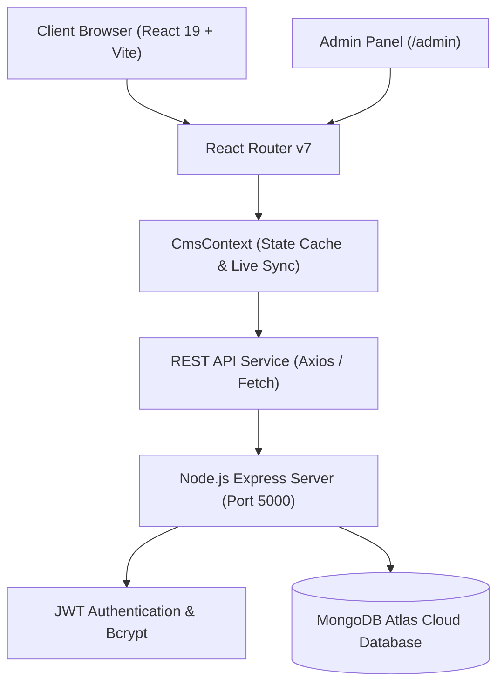

# 🏛️ Saudagar Properties — Ultra-Luxury Real Estate & Dynamic CMS Platform

<div align="center">


<br/>

**A full-stack, enterprise-grade luxury real estate web application and administrative CMS tailored for high-net-worth real estate consulting in DLF Gurugram and prime NCR corridors.**

[Explore Live Demo](#-quick-start) • [CMS Architecture](#-admin-cms-portal) • [API Documentation](#-api-endpoints) • [Setup Guide](#-local-installation--setup)

</div>

---

## 🌟 Executive Overview

**Saudagar Properties** is a modern, high-performance real estate portal engineered to represent high-end residential, commercial, and industrial properties in Gurgaon (DLF Phase 1–5, Golf Course Road, Cyber City, Southern Peripheral Road, and Dwarka Expressway).

The platform features an **Ultra-Luxury Editorial Design System** (gold accents `#C5A880`, navy slate tones `#0C101A`, glassmorphic cards, and fluid 3D micro-animations) backed by an administrative Content Management System (CMS) that delivers **real-time synchronization** across all public web sections without requiring hardcoded updates or client redeployments.

---

## 💎 Key Features

### 🏢 Public Experience
- **Interactive 3D Corridors Stage**: Fluid rotating 3D carousel showcasing signature luxury builder floors, villas, and penthouses.
- **Top Consultant Spotlight**: Dedicated authority section highlighting 25+ years of market leadership and strategic advisory.
- **3-Step Process Methodology**: Expandable interactive cards outlining the acquisition workflow with live checklist highlights.
- **DLF Dedicated Desk**: High-impact callout banner featuring dynamic animated numerical metric counters.
- **Interactive Location & Map**: Embedded Google Maps geolocation with direct navigation triggers.
- **Persistent Floating Quick Contact Widgets**: Bottom-right floating WhatsApp contact action with prefilled messages and back-to-top scroll trigger.
- **Newsletter Subscription**: Instant newsletter subscription banner with client-side validation and feedback states.

### ⚙️ Administrative CMS Suite (`/admin`)
- **12 Dynamic Section Editors**: Modularized tabs managing text, banners, telephone numbers, navigation links, and arrays across the entire website.
- **Featured Properties Manager**: Full CRUD suite for builder floors, penthouses, and commercial plots (Title, location, price, BHK, tag badges, amenities, and image galleries).
- **Client Perspectives (Testimonials)**: Comprehensive review manager for quotes, investor designations, star ratings, and avatars.
- **Lead Inquiries Management**: Real-time incoming consultation requests, contact submissions, and lead status tracking.
- **Dual-Mode Editor**: Toggle between intuitive structured visual form editors and raw JSON schema editing with automated validation.

---

## 🏗️ Architecture & Tech Stack



### **Frontend**
| Technology | Version | Purpose |
| :--- | :--- | :--- |
| **React** | `19.2` | Core component architecture |
| **Vite** | `8.2` | Lightning-fast development & production bundling |
| **Tailwind CSS** | `4.3` | Utility-first styling & curated luxury color palette |
| **Framer Motion** | `13.1` | Fluid layout transitions, 3D cards & micro-animations |
| **Lucide React** | `1.33` | Modern icon toolkit |
| **React Router** | `7.18` | Client-side routing with protected admin pathways |

### **Backend**
| Technology | Version | Purpose |
| :--- | :--- | :--- |
| **Node.js** | `v22+` | JavaScript runtime environment |
| **Express.js** | `5.2` | High-performance RESTful API framework |
| **MongoDB Atlas** | `9.10` | Cloud NoSQL database with Mongoose ODM |
| **JWT** | `9.0` | Stateless token-based admin authentication |
| **Bcrypt.js** | `3.0` | Secure credential hashing |
| **CORS** | `2.8` | Cross-Origin Resource Sharing handling |

---

## 📁 Repository Structure

```bash
Saudagar Properties/
├── Backend/
│   ├── config/             # Database connection & Atlas configuration
│   ├── controllers/        # Section, Property, Inquiry & Auth controllers
│   ├── middleware/         # JWT verification & error handling
│   ├── models/             # Mongoose schemas (SectionContent, Property, etc.)
│   ├── routes/             # REST API endpoint definitions
│   ├── seed.js             # Initial database seeder for all 12 sections
│   ├── server.js           # Express application entrypoint
│   └── package.json
│
├── Frontend/
│   ├── src/
│   │   ├── components/
│   │   │   ├── admin/
│   │   │   │   ├── common/     # Reusable FormInput, FormTextarea, SectionHeader
│   │   │   │   └── sections/   # 12 Modular Section Editors (Navbar, Hero, etc.)
│   │   │   ├── layout/         # Dynamic Navbar & Footer
│   │   │   └── ui/             # FloatingWidgets, badges & modals
│   │   ├── context/            # CmsContext (Global section cache & updates)
│   │   ├── pages/
│   │   │   ├── Home.jsx        # Landing page assembling all dynamic sections
│   │   │   └── admin/          # AdminDashboard, AdminSectionsCMS, etc.
│   │   ├── sections/home/      # Public landing page sections & sub-modules
│   │   ├── services/           # API integration services
│   │   └── App.jsx             # Main routing configuration
│   └── package.json
│
└── README.md
```

---

## 🚀 Local Installation & Setup

### 1. Prerequisites
- **Node.js** (`>= 18.x` recommended, tested with Node `v22.x`)
- **npm** (`>= 9.x`)
- **MongoDB Atlas** cluster URI or a local MongoDB instance

---

### 2. Clone the Repository
```bash
git clone https://github.com/hiteshjoshi12/Neem-Infra.git
cd "Saudagar Properties"
```

---

### 3. Backend Setup

1. **Navigate to the Backend directory:**
   ```bash
   cd Backend
   ```

2. **Install dependencies:**
   ```bash
   npm install
   ```

3. **Configure Environment Variables:**
   Create a `.env` file in the `Backend/` directory with the following configuration:
   ```env
   PORT=5000
   MONGO_URI=your_mongodb_connection_string
   JWT_SECRET=your_jwt_secret_key_here
   ADMIN_EMAIL=admin@saudagarproperties.com
   ADMIN_PASSWORD=admin123
   ```

4. **Seed the Database with Initial Sections & Content:**
   ```bash
   npm run seed
   ```

5. **Start the Backend Server:**
   ```bash
   npm run dev
   # Server runs on http://localhost:5000
   ```

---

### 4. Frontend Setup

1. **Open a new terminal and navigate to the Frontend directory:**
   ```bash
   cd Frontend
   ```

2. **Install dependencies:**
   ```bash
   npm install
   ```

3. **Start the Vite Development Server:**
   ```bash
   npm run dev
   # Vite dev server runs on http://localhost:5173
   ```

4. **Build for Production (Optional):**
   ```bash
   npm run build
   ```

---

## 🔐 Administrative Access

The administrative dashboard provides secured access to real-time content management:

- **Login URL**: `http://localhost:5173/admin/login`
- **Default Email**: `admin@saudagarproperties.com`
- **Default Password**: `admin123` *(configurable in `.env`)*

Once authenticated, navigate between:
- 📊 **Dashboard Overview**: Quick statistics and direct section jump links.
- 📝 **Section Content Manager**: 12 dedicated section editors.
- 🏡 **Properties Inventory**: Builder floors, luxury villas, and plots CRUD.
- ⭐ **Client Perspectives**: Testimonials, star ratings, and quotes.
- 📬 **Client Inquiries**: Contact submissions and consultation requests.

---

## 📡 API Endpoints

### Authentication
| Method | Endpoint | Description | Access |
| :--- | :--- | :--- | :--- |
| `POST` | `/api/auth/login` | Authenticate admin credentials and generate JWT | Public |
| `GET` | `/api/auth/me` | Verify active admin session | Protected |

### Sections Content Management (CMS)
| Method | Endpoint | Description | Access |
| :--- | :--- | :--- | :--- |
| `GET` | `/api/sections` | Fetch all 12 dynamic sections | Public |
| `GET` | `/api/sections/:key` | Fetch single section content by key | Public |
| `PUT` | `/api/sections/:key` | Update section content in real-time | Protected |

### Properties & Inventory
| Method | Endpoint | Description | Access |
| :--- | :--- | :--- | :--- |
| `GET` | `/api/properties` | Fetch all luxury listings | Public |
| `POST` | `/api/properties` | Create new property listing | Protected |
| `PUT` | `/api/properties/:id` | Update property listing details | Protected |
| `DELETE` | `/api/properties/:id` | Remove property listing | Protected |

### Inquiries & Leads
| Method | Endpoint | Description | Access |
| :--- | :--- | :--- | :--- |
| `GET` | `/api/inquiries` | Retrieve all consultation leads | Protected |
| `POST` | `/api/inquiries` | Submit new property consultation request | Public |
| `PUT` | `/api/inquiries/:id/status` | Mark inquiry status (new/read/contacted) | Protected |

---

## 🎨 Design Tokens & Palette

| Token | Hex Code | Visual Preview | Usage |
| :--- | :--- | :--- | :--- |
| **Luxury Gold** | `#C5A880` | `■` | Primary badges, accent titles, highlights, CTA hover states |
| **Dark Gold** | `#B39366` | `■` | Gradient borders, button shadows |
| **Midnight Navy** | `#0C101A` | `■` | Admin background, high-contrast dark sections |
| **Rich Charcoal** | `#121724` | `■` | Admin card containers, form backgrounds |
| **Slate Navy** | `#1D263B` | `■` | Public primary headings, high-contrast typography |
| **Warm Ivory** | `#FAF8F5` | `■` | Secondary card backgrounds, subtle contrast fills |

---

## 🛡️ License

This project is licensed under the **MIT License**.

---

<div align="center">
  <sub>Crafted with precision for <strong>Saudagar Properties Pvt. Ltd.</strong> • DLF Phase 2, Gurugram</sub>
</div>
